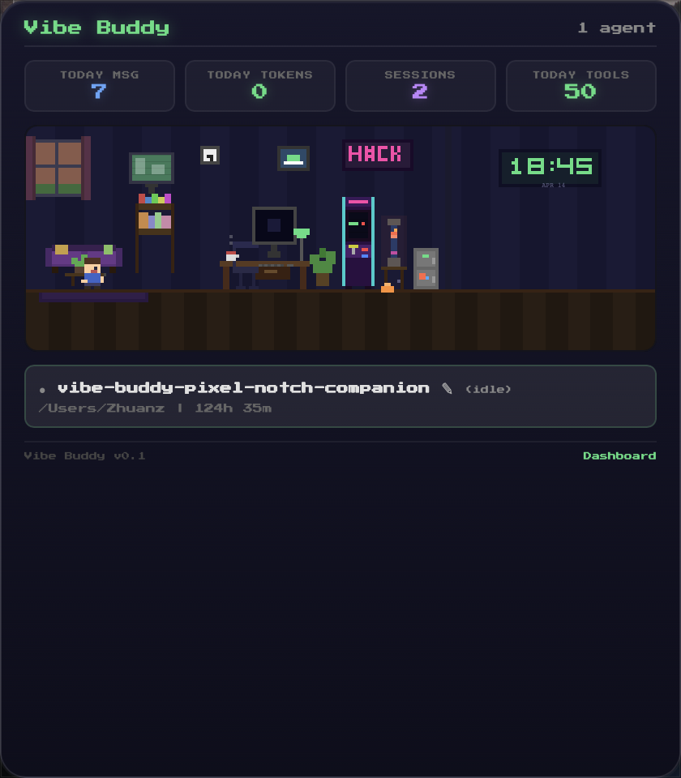
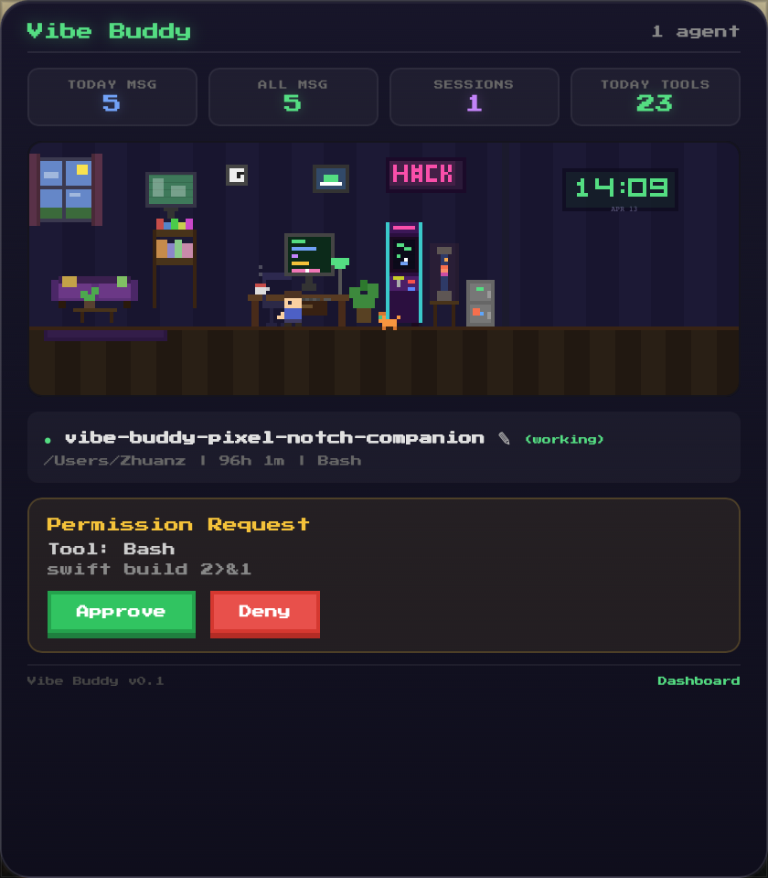
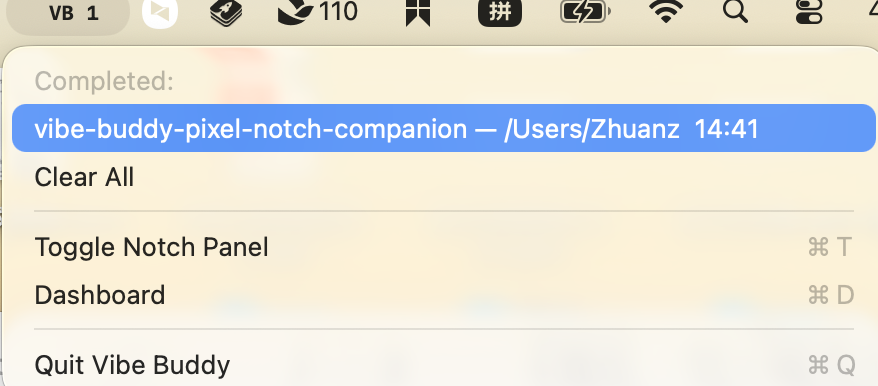

<p align="center">
  
  
  
  
  
</p>

<h1 align="center">Vibe Buddy</h1>

<p align="center">
  <b>A pixel-art floating companion for Claude Code on macOS</b><br>
  <i>Real-time agent status, bash approval, token tracking — all from a tiny floating bubble.</i>
</p>

<p align="center">
  <a href="#features">Features</a> |
  <a href="#screenshots">Screenshots</a> |
  <a href="#installation">Installation</a> |
  <a href="#how-it-works">How it works</a> |
  <a href="#build-from-source">Build</a> |
  <a href="#中文说明">中文</a>
</p>

---

## What is Vibe Buddy?

Vibe Buddy is a macOS menu-bar app that gives you a **floating pixel-art bubble** showing what your Claude Code agents are doing — in real time. No more switching to the terminal to check status or approve commands.

Think of it as a **Dynamic Island for Claude Code**: a tiny always-on-top window with animated pixel characters working at desks, watching TV, or celebrating when tasks are done.

---

## Screenshots

<table>
<tr>
<td width="50%">

### Expanded Panel — Pixel Room & Stats


> Cozy pixel room with day/night cycle, arcade cabinet, lava lamp, digital clock, and a pixel cat roaming around.

</td>
<td width="50%">

### Bash Command Approval


> When Claude Code wants to run a bash command, the bubble auto-expands. Press **Enter** to approve or **Escape** to deny.

</td>
</tr>
<tr>
<td colspan="2">

### Menu Bar Notifications


> Agent finished? The menu bar shows a badge count. Click to see details and **jump to the terminal**.

</td>
</tr>
</table>

---

## Features

### Floating Bubble with Live Status
A draggable 72px bubble sits on your desktop. It shows the number of active agents and their current status (Working / Done / Ready). Click to expand into a full detail panel.

### Pixel Art Room Scene
A cozy procedurally-drawn pixel room with:
- **Work area**: desk, monitor with scrolling code, keyboard, coffee cup with steam
- **Lounge area**: sofa, TV cycling through shows, bookshelf, window with real day/night cycle
- **Arcade corner**: mini-games (Space Invaders, Pong, Snake, Tetris), lava lamp, neon "HACK" sign, mini fridge
- **Digital clock** showing real time
- **Pixel cat** that roams, sits, and sleeps

Each agent gets their own pixel character that walks between the desk and the sofa based on their working status.

### Bash Command Approval
When Claude Code wants to run a bash command, the bubble auto-expands and shows the command for your review. Press Enter to approve or Escape to deny — no need to switch to the terminal. Non-bash tools are auto-approved.

### Menu Bar Notifications
When an agent finishes, the menu bar icon shows a badge count (like chat notifications). Click to see which agent finished and **jump directly to its terminal window** (supports Ghostty, Terminal.app, iTerm2, Warp).

### Real-time Statistics
- **Floating panel**: Today's messages, tokens, sessions, and tool calls
- **Dashboard window**: 7-day activity and token charts with pixel-art bar graphs
- All stats are self-maintained via Claude Code hooks (no stale cache files)

### Agent Management
- View each agent's status, project path, run duration, and last tool used
- **Custom agent names**: click the pencil icon to rename agents (persisted across sessions)

### Quality of Life
- **Single instance protection**: only one bubble on screen at a time
- **Right-click context menu**: Expand/Collapse, Dashboard, Quit
- **Position memory**: bubble remembers where you dragged it
- **Auto hook management**: installs Claude Code hooks on launch, removes on quit

---

## Installation

### Download Binary

Download the latest release from [GitHub Releases](https://github.com/abinggo/VibeCoding-Buddy/releases):

1. Download `VibeBuddy.zip` (Universal Binary — supports both Intel and Apple Silicon)
2. Unzip and move `Vibe Buddy.app` to `/Applications`
3. Launch it — a "VB" icon appears in the menu bar and a floating bubble on your desktop
4. **Restart any running Claude Code sessions** to load the hooks

> **Note**: On first launch, macOS may block the app since it's not code-signed. Right-click the app → **Open** → click **Open** again, or go to **System Settings → Privacy & Security** and click "Open Anyway".

### Build from Source

Requires Xcode Command Line Tools (Swift 5.9+):

```bash
git clone https://github.com/abinggo/VibeCoding-Buddy.git
cd VibeCoding-Buddy
swift build && .build/debug/VibeBuddy
```

Build a universal release `.app` bundle:

```bash
make bundle-universal    # creates build/Vibe Buddy.app (Intel + Apple Silicon)
make dmg                 # creates build/VibeBuddy.dmg
```

---

## How it works

Vibe Buddy uses **Claude Code Hooks** to receive real-time events:

```
Claude Code CLI
  ├─ UserPromptSubmit → user sends a message
  ├─ PreToolUse       → tool about to run (Bash → approval UI)
  ├─ PostToolUse      → tool finished
  ├─ Stop             → agent turn complete (with token counts)
  └─ Notification     → system notification

        │ HTTP POST to localhost
        ▼
  Vibe Buddy (Swift + WKWebView)
  ├─ HookServer      receives events
  ├─ AppDelegate     updates state, manages approval flow
  ├─ WebViewBridge   pushes state to pixel UI
  └─ LiveStats       persists usage metrics
```

**Zero dependencies** — pure Swift with SPM, using only macOS system frameworks (AppKit, WebKit, Network).

---

## Tech Stack

| Component | Technology |
|-----------|-----------|
| App shell | Swift 5.9, AppKit NSPanel |
| Pixel UI | WKWebView, Canvas 2D, NES.css |
| HTTP server | Network.framework (NWListener) |
| Session detection | FileManager watching `~/.claude/sessions/` |
| Statistics | Custom LiveStats with JSON persistence |
| Build system | Swift Package Manager + Makefile |
| Binary | Universal (x86_64 + arm64) |

---

## Known Limitations

- **macOS only** — relies on NSPanel, WKWebView, Network.framework
- **Sub-agents share session ID** — Claude Code's Agent tool sub-tasks appear as one agent; run separate `claude` instances in different terminals for multi-agent display
- **Token data updates per turn** — tokens are reported in the Stop hook, not in real-time

---

## License

MIT

---

<a name="中文说明"></a>

# 中文说明

## Vibe Buddy 是什么？

Vibe Buddy 是一个 macOS 菜单栏应用，为 Claude Code 提供一个**浮动的像素风伴侣气泡**，实时显示 Agent 工作状态。不用再切换到终端查看进度或审批命令了。

你可以把它想象成 **Claude Code 的灵动岛**：一个小小的置顶悬浮窗，里面有像素小人在办公桌前敲代码、在沙发上看电视、任务完成时庆祝。

---

## 效果展示

<table>
<tr>
<td width="50%">

### 展开面板 — 像素房间 & 统计数据


> 温馨的像素小房间，包含日夜变化、街机柜、熔岩灯、数字时钟、像素猫等。

</td>
<td width="50%">

### Bash 命令审批


> Claude Code 要执行 Bash 命令时，气泡自动展开。按 **Enter** 批准，**Escape** 拒绝。

</td>
</tr>
<tr>
<td colspan="2">

### 菜单栏消息通知


> Agent 完成了？菜单栏显示未读角标，点击查看详情并**一键跳转终端**。

</td>
</tr>
</table>

---

## 核心亮点

### 浮动气泡 + 实时状态
可拖拽的 72px 气泡常驻桌面，显示活跃 Agent 数量和状态（Working / Done / Ready）。点击展开详情面板。

### 像素风房间场景
程序化绘制的温馨像素小房间：
- **工作区**：办公桌、显示器（工作时滚动代码）、键盘、带蒸汽的咖啡杯
- **休息区**：沙发、电视（轮播节目）、书架、真实日夜变化的窗户
- **娱乐区**：街机柜（5种小游戏）、熔岩灯、霓虹 "HACK" 标牌、小冰箱
- **数字时钟**、**像素猫**（会走来走去、坐下、睡觉）

每个 Agent 对应一个像素角色，工作时坐在工位敲键盘，完成后走到沙发休息。

### Bash 命令审批
Claude Code 要执行 Bash 命令时，气泡自动展开显示命令内容。按 Enter 批准、Escape 拒绝，无需切回终端。其他工具自动放行。

### 菜单栏消息通知
Agent 完成任务后，菜单栏 VB 图标显示未读角标（类似飞书消息提醒）。点击查看哪个 Agent 完成了，**一键跳转到对应终端窗口**（支持 Ghostty、Terminal、iTerm2、Warp）。

### 实时数据统计
- **悬浮面板**：今日消息数、Token 消耗、会话数、工具调用数
- **Dashboard 面板**：7 天活动和 Token 柱状图，柱顶显示具体数字
- 所有数据通过 Hooks 自维护，不依赖可能过期的缓存文件

### Agent 管理
- 查看每个 Agent 的状态、项目路径、运行时长、最后使用的工具
- **自定义命名**：点击 ✎ 图标给 Agent 起名字，跨会话保留

## 安装

### 下载安装

从 [GitHub Releases](https://github.com/abinggo/VibeCoding-Buddy/releases) 下载最新版本：

1. 下载 `VibeBuddy.zip`（通用二进制，同时支持 Intel 和 Apple Silicon）
2. 解压后将 `Vibe Buddy.app` 拖入 `/Applications`
3. 启动 — 菜单栏出现 "VB" 图标，桌面出现浮动气泡
4. **重启正在运行的 Claude Code 会话**以加载 hooks

> **注意**：首次启动时 macOS 可能阻止未签名应用。右键点击 app → **打开** → 再点 **打开**，或到 **系统设置 → 隐私与安全性** 点击"仍要打开"。

### 从源码构建

需要 Xcode Command Line Tools（Swift 5.9+）：

```bash
git clone https://github.com/abinggo/VibeCoding-Buddy.git
cd VibeCoding-Buddy
swift build && .build/debug/VibeBuddy
```

打包通用二进制 .app：

```bash
make bundle-universal    # 生成 build/Vibe Buddy.app（Intel + Apple Silicon）
make dmg                 # 生成 build/VibeBuddy.dmg
```
